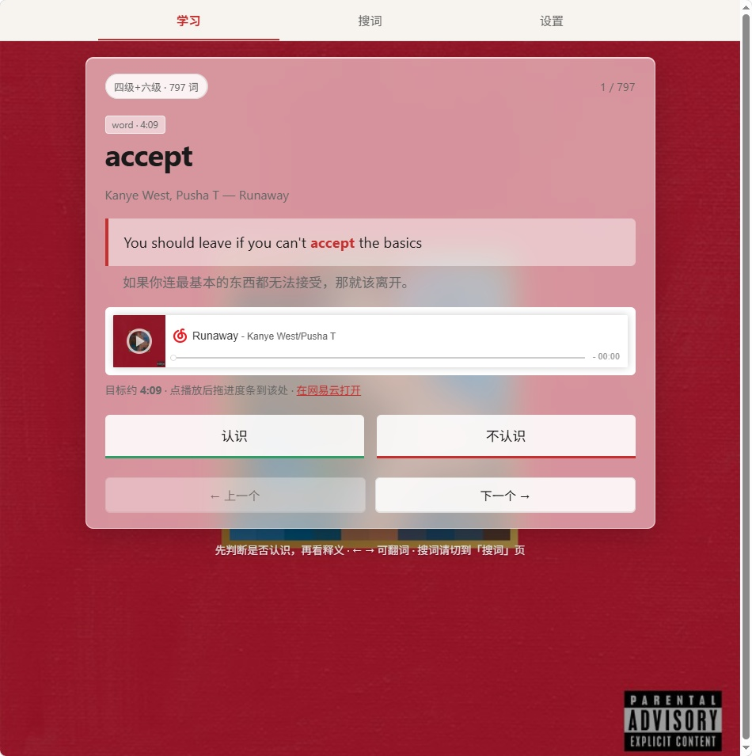

# Song Vocab Agent（最小可跑原型）


用喜欢的欧美歌手歌词 ∩ 四级/六级词表（可切换），点生词跳到歌曲时间点学习。  
设计说明见 [`docs/song-vocab-agent-canvas.md`](../../docs/song-vocab-agent-canvas.md)。

## 你需要什么

- **Node.js 18+**
- Live 建库：本机 [api-enhanced](https://github.com/NeteaseCloudMusicApiEnhanced/api-enhanced)（`http://127.0.0.1:3000`）
- 深度语义：项目根目录 `.env`（DeepSeek，勿提交、勿发到聊天）

本项目本身无需 `npm install`（零依赖）。

## `.env` 配置

在 `workspace/song-vocab-agent/.env`：

```env
# 学习教练 / Mode B / enrich（DeepSeek）
OPENAI_API_KEY=sk-你的密钥
OPENAI_BASE_URL=https://api.deepseek.com
OPENAI_MODEL=deepseek-chat

# 离线 tag-songs（可选；至少配一组即可）
SPOTIFY_CLIENT_ID=你的 Spotify Client ID
SPOTIFY_CLIENT_SECRET=你的 Spotify Client Secret
LASTFM_API_KEY=你的 Last.fm API Key

# 网易云本地 API（可选）
# NETEASE_API_BASE=http://127.0.0.1:3000
```

Spotify：[Developer Dashboard](https://developer.spotify.com/dashboard) 创建 App → Client Credentials。  
Last.fm：[API account](https://www.last.fm/api/account/create) 申请 Key。

## 推荐用法（释义 + 双语 + 深度语义）

```bash
# 1) api-enhanced 已在 3000 端口运行时，按歌单建库（含网易云译文对齐）
node cli.js build --artist "Kanye West" --songs-file data/playlists/kanye_v1.txt

# 2) 启动学习页（默认可在页内切换四级 / 六级 / 全部）
node cli.js serve --artist "Kanye West"
# 或启动时就指定等级：
node cli.js serve --artist "Kanye West" --level cet4
node cli.js serve --artist "Kanye West" --level cet6
# 浏览器打开 http://127.0.0.1:8787/learn
```

学习页包含：

- **词表等级**：顶部切换「四级 / 六级 / 四级+六级」（基于同一歌单词库过滤，不必重建）  
- **学这首**：输入歌名 → `learn_song` 按歌切难点词卡 + 醒目时间戳（iframe 需手动拖进度）  
- **双面释义**：词典义（学术）+ 歌里义（街头）+ 歌手口吻点评（enrich）  
- **认识落盘**：写入 `out/known_words.json`；**小测**：歌词填空（本地判分）  
- **方式 A · 网页搜词**：输入生词 → 直接查当前等级下的索引（不经模型）  
- **方式 B · AI 聊天**：`find_word_in_songs` / `learn_song`（如「我要学 Runaway」）  
- **学习教练**：自然语言描述周目标 / 舒缓旋律 / 主题词 → 7 天 checklist（`POST /api/coach/plan`）  
- **排行榜**：Kanye West / Taylor Swift / J. Cole 热门 50 首的四六级词汇对比（确定性统计）  
- 同一核心：`lib/findWord.js`、`lib/learnSong.js`、`lib/enrich.js`、`lib/coachAgent.js`  

## 歌曲标签（离线 · Spotify + Last.fm）

教练过滤「舒缓 / 旋律」时**只读本地 JSON**，不在聊天时联网。先跑：

```bash
# 需要已有 ranking 或 index
node cli.js rank --artist "Kanye West" --top 50 --level both
node cli.js tag-songs --artist "Kanye West" --top 50
# 覆盖重跑：
node cli.js tag-songs --artist "Kanye West" --top 50 --force
```

产物：`data/song_tags/kanye_west_top50.json`（按网易云 `song_id` 索引；含 `energy`/`tempo` 与 `tags.mellow` 等）。

未跑 `tag-songs` 时，教练仍可出计划，但会提示「已忽略舒缓/旋律筛选」。

## 学习教练（Ch.02 + Ch.09）

```bash
node cli.js serve --artist "Kanye West" --level cet6
# 浏览器打开「学习教练」Tab，例如输入：
# 这周学 30 个六级词，要舒缓旋律好听一点，偏情绪和抽象词
```

流程：解析自然语言 → `get_learning_progress` → `get_song_candidates`（读 ranking + song_tags + `theme_seeds.json`）→ `build_week_plan` → 落盘 `out/plans/week_current.json`。  
点击计划中的歌名会跳回学习页并调用 `learn_song`。

API：

- `POST /api/coach/plan` `{ message }`
- `GET /api/coach/plan` 当前计划
- `POST /api/coach/plan/accept` `{ plan_id? }`

## 排行榜（Kanye · Taylor · J. Cole）

统计逻辑在 `lib/rank.js`：从歌词索引数**唯一词**与**命中次数**，不经 LLM。

```bash
# 先确保 api-enhanced 在 3000 端口；缺索引时会自动 build 热门 50
node cli.js rank-all --top 50 --level both

# 或单歌手
node cli.js build --artist "Taylor Swift" --limit 50
node cli.js rank --artist "Taylor Swift" --top 50 --level cet6

node cli.js rank --artist "J. Cole" --top 50 --level both --build
```

产物写入 `out/rankings/`，学习页打开「排行榜」Tab，或：

- `GET /api/rankings`
- `GET /api/ranking?artist=Kanye%20West&level=both&top=50`
- `GET /api/ranking/summary?level=both`

玩法创意见 [`docs/playability-agent-ideas.md`](docs/playability-agent-ideas.md)。

## Demo（不连网易云 / 可不配 Key）

```bash
node cli.js build --demo --artist "Kanye West"
node cli.js learn --demo
```

## 产物

- `data/cet4_words.txt` / `cet6_words.txt` — 四、六级词表（建库取并集；学习时按等级过滤）  
- `data/cet46_glossary.json` — 四六级合并释义（另有分册 `cet4_glossary.json` / `cet6_glossary.json`）  
- `out/kanye_west_cet6_index.json` — 歌单词库索引（含四级+六级命中；文件名沿用旧后缀）  
- `out/rankings/*_top50_*.json` — 歌手热门歌曲词汇排行榜  
- `data/song_tags/*_top50.json` — Spotify+Last.fm 离线标签  
- `data/theme_seeds.json` — 主题种子词（emotion / abstract / …）  
- `out/plans/week_current.json` — 当前周学习计划  
- `out/enrich/*.json` — 深度语义缓存  
- `out/player/learn.html` — 静态页备份  

## 和课程的对应

| 概念 | 这里落在哪 |
|------|------------|
| Ch.01–03 tools | build / enrich / play / rank / coach tools |
| Ch.02 loop | `lib/coachAgent.js`（MAX_STEPS=6） |
| Ch.04 context | enrich / coach system + 易变用户消息 |
| Ch.09 checklist | `lib/coachPlan.js` 7 天计划 |
| Ch.13 connectors | api-enhanced、DeepSeek、Spotify、Last.fm |
| Ch.16/17 | 排行榜与过滤用确定性统计；标签离线写入 |
| Ch.22 canvas | `docs/song-vocab-agent-canvas.md` / `docs/playability-agent-ideas.md` |

## 自用与版权

仅供个人学习实验。不要分发歌词/音轨；API Key 只放本机 `.env`。
