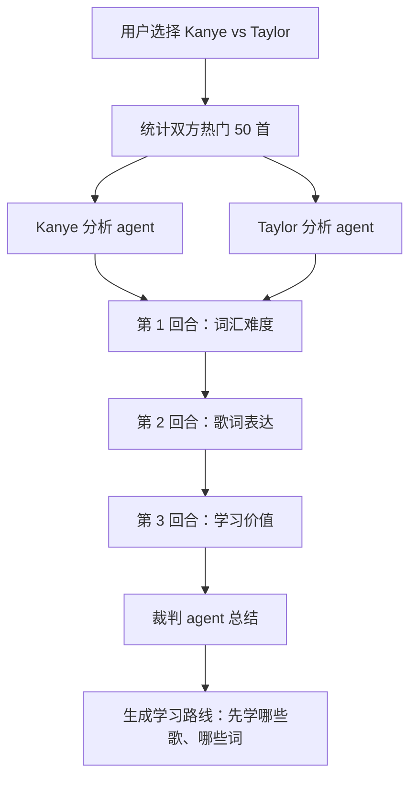

# Song Vocab Agent 可玩性与 Agent 玩法设计

## 目标

现在的 Song Vocab Agent 已经能完成「歌手歌词 x 四六级词表」的基础学习闭环：建库、搜词、学习卡片、DeepSeek 语义解释。下一步如果要提高可玩性，重点不应该只是加更多按钮，而是把产品从「背单词工具」升级成「围绕歌手、歌曲、歌词语言风格的学习游戏」。

核心方向：

- 用确定性工具做可靠统计：热门 50 首歌、六级词汇量、词汇密度、歌曲难度。
- 用 agent 做开放式体验：歌手切磋、歌词法庭、学习教练、每日挑战、个性化复习。
- 用课程里的 agentic system 概念做成可讲、可演示、可扩展的项目，而不是硬贴 agent 标签。

## 玩法一：歌手词汇排行榜

### 一句话

统计某个歌手热门 50 首歌里的六级词汇量，生成排行榜，展示「谁的歌更适合刷六级」。

### 为什么好玩

用户天然会想比较：

- Kanye West vs Taylor Swift，谁的六级词汇更多？
- Eminem 是不是词汇密度最高？
- Taylor 哪张时期的词更文学？
- The Weeknd 的歌适合学情绪词，还是日常词？
- Kendrick Lamar 的歌词是不是更难？

### 指标设计

不要只看「六级词出现次数」，否则长歌会占便宜。建议做多个指标：

| 指标 | 解释 | 用途 |
|------|------|------|
| `cet6_unique_count` | 不重复六级词数量 | 词汇覆盖量 |
| `cet6_total_hits` | 六级词出现总次数 | 高频复现强度 |
| `cet6_density` | 每 1000 个英文 token 的六级词数 | 歌曲真实难度 |
| `rarity_score` | 按低频词加权 | 找高级词 |
| `learn_value` | 词义清晰、句子完整、可解释程度 | 推荐学习价值 |
| `repeatability` | 同一词在多首歌中复现 | 是否适合记忆 |

推荐综合分：

```txt
score =
  0.35 * normalized(cet6_density)
+ 0.25 * normalized(cet6_unique_count)
+ 0.20 * normalized(rarity_score)
+ 0.20 * normalized(learn_value)
```

### 页面形态

新增 Tab：`排行榜`

页面模块：

- 歌手输入框：`Kanye West`、`Taylor Swift`、`Eminem`
- 统计范围：热门 10 / 30 / 50 首
- 词表范围：四级 / 六级 / 四六级
- 排行榜：
  - 歌曲名
  - 六级词数量
  - 六级词密度
  - 推荐学习词
  - 点击进入学习
- 歌手总览卡：
  - 总词数
  - 六级唯一词
  - 最难歌曲
  - 最值得学歌曲
  - 风格标签：文学型 / 口语型 / 抽象型 / 情绪型 / 叙事型

### 需要的工具

确定性 tools：

- `get_artist_top_songs(artist, limit)`
- `build_artist_vocab_index(artist, songs)`
- `rank_songs_by_vocab(index, level)`
- `explain_ranking(songStats)`

这里不必让模型直接统计。模型负责解释和推荐，统计必须由代码完成。

课程对应：

- Ch.01 Function Calling：排行榜解释可以是一次 tool call。
- Ch.03 Tools Validation：`artist`、`limit`、`level` 必须校验，避免乱抓。
- Ch.13 Connectors：通过 api-enhanced 获取歌曲、歌词、热门歌曲。
- Ch.16 Observability：记录每次 build、rank 的耗时、失败、命中率。

## 玩法二：Kanye vs Taylor 切磋模式

### 一句话

用户选择两个歌手，系统让两个「歌手分析 agent」围绕词汇、歌词、主题、学习价值进行友好切磋，最后由裁判 agent 给出结论和学习建议。

注意：这不是造谣或人身攻击，而是基于公开歌词数据做「语言风格 battle」。

### 为什么适合 agent

排行榜是确定性统计，agent 不必要。切磋模式不同，它需要：

- 选择证据：从大量歌词中挑代表性句子。
- 组织论点：为什么这个词高级、为什么这句适合学习。
- 多轮交锋：一方提出观点，另一方回应。
- 裁判总结：按证据给分，不只是聊天。

这正好对应 agent loop。

### 基础流程



### 切磋回合

| 回合 | 比什么 | 证据 |
|------|--------|------|
| 词汇量 | 六级词唯一数、密度、稀有词 | 排行榜统计 |
| 表达力 | 抽象概念、隐喻、情绪表达 | 歌词行样本 |
| 学习价值 | 词义是否清晰、句子是否好记 | 词典义 + 歌词上下文 |
| 复现率 | 同一高级词是否跨歌出现 | index 统计 |
| 风格 | 叙事 / 情绪 / 口语 / 文学 | agent 归纳 |

### 输出示例

```txt
Kanye 本轮优势：六级词密度更高，抽象词更多，如 concept / dimension / conscious。
Taylor 本轮优势：句子更完整，更适合从上下文学习，如 tolerate / delicate / exile。
裁判建议：如果目标是六级词汇量，先刷 Kanye；如果目标是完整英文表达，Taylor 更适合精读。
```

### Agent 设计

可以做三个 agent，而不是一个大而全 agent：

- `ArtistScoutAgent`：只读数据，找证据。
- `DebateAgent`：组织某位歌手的论点。
- `JudgeAgent`：读取双方证据，给分和学习建议。

课程对应：

- Ch.02 Agent Loop：多轮观察、行动、反思、停止。
- Ch.09 Planning Patterns：切磋前先规划 3 个回合。
- Ch.10 Multi-agent Delegation：双方 scout 并行分析，再交给裁判综合。
- Ch.12 Human in the Loop：用户确认是否生成公开分享文案，避免过激表达。
- Ch.16 Observability：记录每轮使用了哪些证据、哪些 tool、花了多少 token。

## 玩法三：歌词法庭

### 一句话

用户输入一个词或一句歌词，agent 扮演「检方 / 辩方 / 法官」，判断这个词在歌曲里到底是什么意思。

### 例子

用户点开 `bound`：

- 检方：这个词在这里不是简单的「边界」，更像命运绑定。
- 辩方：但从歌词语境看，也可以理解为关系约束。
- 法官：结合歌名和上下文，给出最适合学习的解释。

### 为什么好玩

它把普通释义变成一场小剧场，尤其适合多义词、抽象词、俚语、隐喻。

### 需要的工具

- `get_word_occurrences(word, artist?)`
- `get_lyric_context(songId, tMs, window)`
- `lookup_gloss(word, level)`
- `enrich_word_in_context(word, line, song)`

课程对应：

- Ch.01：一次查词 tool。
- Ch.02：多轮推理，必要时再查上下文。
- Ch.04：稳定 prompt 放角色和规则，变化内容放歌词上下文。
- Ch.18 Safety：歌词里可能有攻击性内容，输出要做学习化转写。

## 玩法四：专辑 Boss Rush

### 一句话

把一张专辑变成一关，用户需要通过若干首歌的生词挑战，打败这个专辑 Boss。

### 设计

每张专辑生成：

- Boss 名：如 `Runaway Boss`、`1989 Boss`
- 难度：按六级词密度
- 关卡：每首歌 5 个词
- 技能：
  - 高频复现词：加深记忆
  - 隐喻词：需要看「在这首歌里」
  - Boss 词：整张专辑最值得学的 10 个词

### 学习闭环

1. 先测：认识 / 不认识。
2. 再揭示：释义 + 歌词语境。
3. 最后复盘：本专辑你掌握了哪些词。

课程对应：

- Ch.08 State and Persistence：保存用户进度、Boss 血量、已掌握词。
- Ch.06 Long-term Recall：跨 session 记住用户薄弱词。
- Ch.20 Proactive Agents：每天自动推送一个 Boss 复习包。

## 玩法五：歌手风格雷达图

### 一句话

给每个歌手生成一个「英语学习风格画像」。

### 维度

- 六级词密度
- 抽象词比例
- 情绪词比例
- 叙事完整度
- 口语表达比例
- 隐喻强度
- 复现率

### 例子

```txt
Kanye West：抽象概念高，情绪冲突强，适合学高级词和表达张力。
Taylor Swift：叙事完整度高，情绪表达细，适合学完整句子和关系词。
Eminem：词汇密度高，押韵复杂，适合挑战听力和词形识别。
```

### 课程对应

- Ch.06 Hybrid Retrieval：找相似风格歌曲时，可以用全文搜索 + 向量检索。
- Ch.16 Evals：让用户给画像是否准确打分，形成评估集。
- Ch.21 Self-evolving Agents：根据用户反馈改进风格标签规则，但需要人工确认。

## 玩法六：学习教练 Agent

### 一句话

系统不只告诉你这个词是什么意思，还根据你的点击历史推荐下一批歌和词。

### 需要记住什么

- 用户总是点「不认识」的词。
- 用户喜欢哪些歌手。
- 用户更适合四级、六级，还是混合。
- 用户是否更喜欢解释型、游戏型、排行榜型学习。

### 教练可以说

```txt
你最近经常卡在 abstract / concept / conscious 这类抽象词。
建议今天先学 Kanye 的 5 首歌，每首只挑 3 个抽象词。
Taylor 的叙事句子可以作为第二阶段，用来练完整表达。
```

课程对应：

- Ch.05 Short-term Memory：当前学习 session 的已知 / 未知词。
- Ch.06 Long-term Recall：长期薄弱词、偏好歌手。
- Ch.07 Memory Writing：不是每次点击都写入长期记忆，做 curator。
- Ch.08 Persistence：进度不能因为服务重启丢失。

## 玩法七：每日 Diss / Duet 挑战

### 一句话

每天自动生成一个小挑战：两个歌手各出 5 个六级词，用户猜哪个歌手用过这个词。

### 例子

```txt
今天挑战：Kanye vs Taylor
1. delicate
2. conscious
3. exile
4. dimension
5. reputation

猜：这些词分别更可能出现在哪位歌手的热门歌里？
```

### 为什么适合 proactive agent

用户不会每天主动打开工具，但每天一个 3 分钟挑战很容易形成习惯。

课程对应：

- Ch.20 Proactive Agents：cron 每天生成挑战。
- Ch.12 HITL：默认只生成，不主动发通知；用户 opt-in 后再提醒。
- Ch.16 Metrics：挑战完成率、正确率、复习转化率。

## 玩法八：Playlist Draft 选秀

### 一句话

用户设定目标，agent 自动从歌手热门歌里选出一套学习歌单。

目标例子：

- 「我要一周刷 50 个六级词」
- 「我想用 Taylor 学情绪表达」
- 「我想用 Kanye 学抽象词」
- 「我只想听歌，不想太难」

Agent 输出：

- 7 天计划
- 每天 3 首歌
- 每首歌 5 个重点词
- 为什么这么排

课程对应：

- Ch.09 Planning：生成 checklist 型学习计划。
- Ch.02 Agent Loop：根据用户反馈 replan。
- Ch.17 Cost Strategy：计划生成用模型，统计仍用确定性 tool。

## 玩法九：歌词宇宙地图

### 一句话

把不同歌手、歌曲、单词连接成一张图。

节点：

- 歌手
- 歌曲
- 单词
- 主题：爱情、名望、孤独、信仰、自我、冲突

边：

- 歌曲包含单词
- 歌手高频使用主题
- 两个歌手共享某些高级词
- 某个词在不同歌手那里语义不同

玩法：

- 点一个词，看哪些歌手都用过。
- 点两个歌手，看共享词和差异词。
- 点一个主题，看对应歌曲学习路线。

课程对应：

- Ch.06 Retrieval：按词、主题、歌手检索。
- Ch.13 Connectors：未来可接图数据库或本地 SQLite。
- Ch.22 Design Canvas：这是项目从工具到知识型 agent 的扩展方向。

## 推荐的第一版 MVP

不要一口气做所有玩法。建议先做一个能明显变好玩的版本。

### MVP 1：排行榜

最值得先做，因为它确定性强、可展示、低风险。

功能：

- 新增 `rank` 命令：

```bash
node cli.js rank --artist "Kanye West" --top 50 --level cet6
node cli.js rank --artist "Taylor Swift" --top 50 --level cet6
```

- 生成：

```txt
out/rankings/kanye_west_top50_cet6.json
out/rankings/taylor_swift_top50_cet6.json
```

- Web 新增 `排行榜` Tab。

### MVP 2：Kanye vs Taylor 切磋

基于排行榜结果做，不要一开始就让 agent 到处查。

功能：

- 用户选择两个歌手。
- 系统读取双方 ranking。
- agent 只负责：
  - 选证据
  - 组织 3 回合切磋
  - 生成裁判总结

### MVP 3：学习路线

切磋结束后，不只是看热闹，而是落回学习：

```txt
根据这场切磋，推荐你先学：
1. Kanye - Runaway：accept / conscious / basic
2. Taylor - exile：exile / tolerate / delicate
3. Kanye - Bound 2：bound / champagne / afford
```

点击可以直接进入学习卡片。

## 建议新增的文件结构

```txt
lib/
  rank.js              # 歌曲/歌手词汇统计
  battle.js            # 切磋流程，不直接碰模型 API
  coach.js             # 学习路线推荐
  stats.js             # 通用统计函数

data/
  artists/
    kanye_west_top50.txt
    taylor_swift_top50.txt

out/
  rankings/
    kanye_west_top50_cet6.json
    taylor_swift_top50_cet6.json
  battles/
    kanye_vs_taylor_*.json
```

## 建议新增的 Agent Tools

| Tool | 是否确定性 | 作用 | 状态 |
|------|------------|------|------|
| `find_word_in_songs` | 是 | 查词定位 | 已有 |
| `learn_song` | 是 | 按歌学：抽词表 + 首词时间戳 | **已有** |
| `get_artist_ranking` | 是 | 读取歌手排行榜 | 待做 |
| `compare_artist_vocab` | 是 | 对比两个歌手统计 | 待做 |
| `sample_evidence_lines` | 是 | 按词/主题抽歌词证据 | 待做 |
| `draft_debate_round` | 否 | 生成一回合切磋文本 | 延后（battle） |
| `judge_battle` | 否 | 裁判总结 | 延后（battle） |
| `recommend_learning_path` | 否 | 生成学习路线 | 延后 |
| `save_user_progress` | 是，有副作用 | 保存认识/不认识 | **已用 `/api/known`** |

工具设计原则：

- 统计类必须确定性，不能让模型凭感觉算。
- 文案类可以用模型，但必须带证据。
- 保存进度属于写操作，未来要加权限/确认边界。

## 和课程章节的系统映射

| 课程章节 | 在本项目里的落点 |
|----------|------------------|
| Ch.01 Function Calling | 搜词、查排行榜、查证据行 |
| Ch.02 Agent Loop | 切磋多回合、歌词法庭、学习教练 |
| Ch.03 Tools Validation | 校验 artist / level / limit / songId，工具结果 envelope |
| Ch.04 Prompts & Context Cache | 固定角色 prompt，变化的歌词证据放 tail |
| Ch.05 Short-term Memory | 当前 session 已认识/不认识、当前 battle 状态 |
| Ch.06 Long-term Recall | 用户长期薄弱词、喜欢的歌手、历史挑战 |
| Ch.07 Memory Writing | 把多次出现的学习偏好写入长期记忆 |
| Ch.08 State & Persistence | Boss Rush 进度、每日挑战、battle 记录 |
| Ch.09 Planning Patterns | 一周学习计划、切磋回合计划 |
| Ch.10 Multi-agent Delegation | Kanye agent / Taylor agent / Judge agent |
| Ch.12 Human in the Loop | 公开分享、长期记忆写入、通知开关需要确认 |
| Ch.13 Connectors | api-enhanced、未来 Discord/Telegram 分享 |
| Ch.14 Skills / MCP / Subagents | 把「歌手风格分析」做成 skill 或 subagent |
| Ch.16 Observability | trace 每场 battle、统计 build 成功率、token 花费 |
| Ch.17 Cost Strategy | 排行榜不用模型，只有总结/切磋用模型 |
| Ch.18 Safety | 处理歌词脏话、diss 内容，避免攻击现实人物 |
| Ch.20 Proactive Agents | 每日挑战、每周歌手榜单、复习提醒 |
| Ch.21 Self-evolving Agents | 根据用户评分优化推荐规则，但保留人工审核 |
| Ch.22 Design Canvas | 从「单词工具」升级为「音乐英语学习 agent」 |

## 关键产品判断

### 什么时候该用 agent

适合 agent：

- 需要选证据、讲道理、总结风格。
- 需要多轮对比、裁判、学习路线。
- 需要记住用户长期偏好。
- 需要根据反馈重新规划。

不适合 agent：

- 统计六级词数量。
- 排序热门歌曲。
- 过滤四级/六级。
- 查某个词是否出现。

这些应由普通代码完成。

### 版权与安全

仍然保持原则：

- 不分发完整歌词。
- 页面只展示学习所需的短句和上下文。
- 切磋输出聚焦语言学习，不做人身攻击。
- 分享内容只包含统计、短引用、学习建议。

## 推荐实施顺序（已按痛点重排）

> **优先级说明（2026-07）**：双面释义 / `learn_song` / 进度持久化 / 生成式小测 **优先于** battle 切磋与向量检索。排行榜已落地；battle 仍有价值，但应排在学习闭环之后。

### 第一期（痛点闭环 · 已实现 / 进行中）

1. **双面释义 enrich**：`gloss_academic`（词典）+ `gloss_slang`（歌里义）+ `artist_note`（歌手口吻）— `lib/enrich.js` + 学习页双栏。
2. **`learn_song`**：按歌抽难点词 → API `/api/learn-song` + Agent tool；前端切 deck；seek 降级为醒目时间戳（网易云 iframe 无法可靠 auto-seek）。
3. **进度持久化**：`POST /api/known` → `out/known_words.json`（兼容旧版纯数组）；「认识」落盘。
4. **生成式小测**：`POST /api/quiz` + `/api/quiz/grade`；本地判分；打卡文案用确定性计数。
5. **学习教练 + 歌曲标签（2026-07）**：`tag-songs`（Spotify+Last.fm → `data/song_tags/`）+ `/api/coach/plan` + 学习页「学习教练」Tab；主题种子 `data/theme_seeds.json`；计划落盘 `out/plans/`。

演示路径：

```txt
学 Runaway → 揭开双面释义 → 点认识落盘 → 点「小测」填空
或 AI 聊天：「我要学 Runaway」→ learn_song tool
```

### 第二期（展示与对比）

5. 按歌「词汇能量图」v0（复用 `rank.js` 聚合，纯前端）。
6. `compare` 命令 / 歌手对比页。
7. Hip-hop 特征种子库（`data/hiphop_senses.json` 注入 enrich，非向量）。

### 第三期（延后）

8. `battle.js` 三回合切磋 + Web Tab。
9. 每日挑战、Boss Rush、学习教练。
10. **向量检索**（「我想学关于失败的词」）— 等进度与双面释义验证后；主题检索可先用种子词表近似。

## 最推荐先做的 Demo

学习闭环（优先）：

```bash
node cli.js serve --artist "Kanye West"
# 浏览器：输入 Runaway →「学这首」→ 认识 →「小测」
```

排行榜（已有）：

```bash
node cli.js rank --artist "Kanye West" --top 50 --level cet6
node cli.js rank --artist "Taylor Swift" --top 50 --level cet6
```

切磋（第三期，未实现）：

```bash
node cli.js battle --left "Kanye West" --right "Taylor Swift" --level cet6
```

